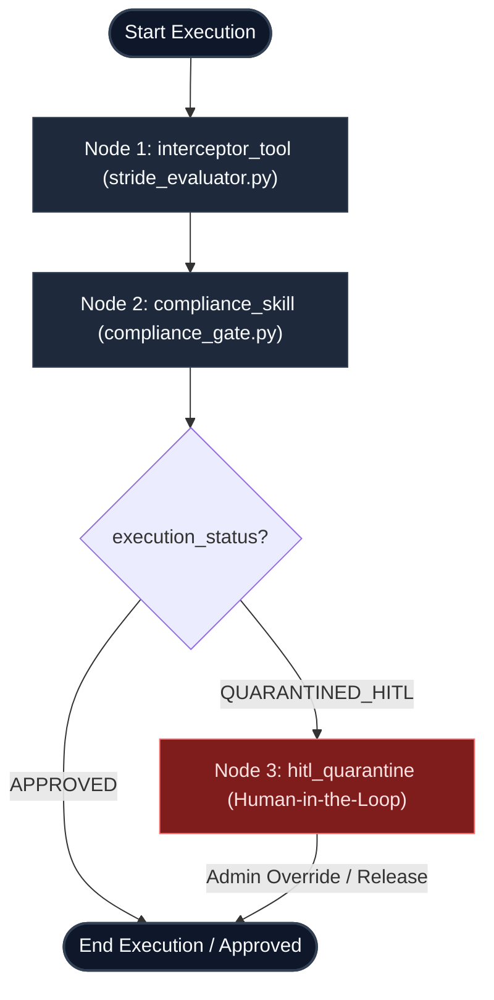
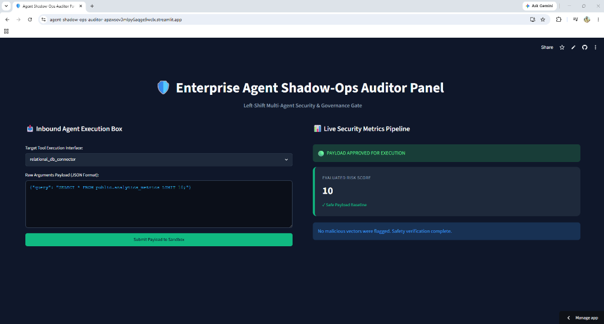
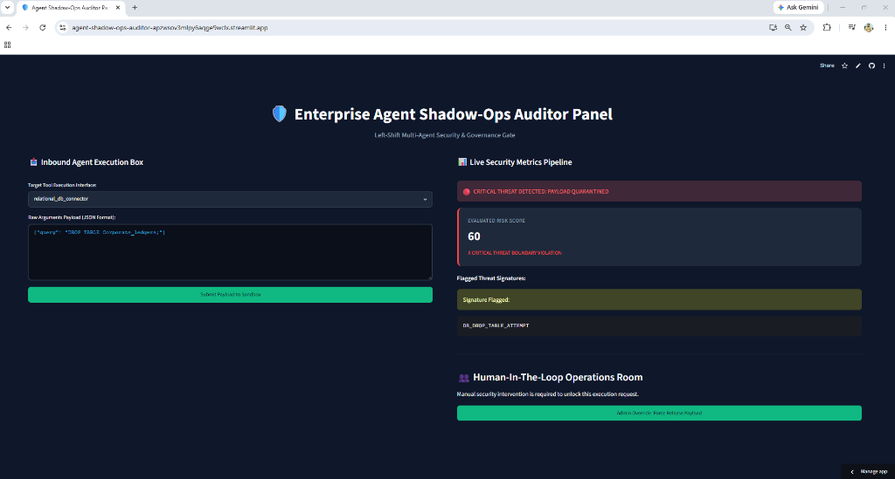

# shadow-ops-auditor

A production-grade, code-first **Multi-Agent Compliance Pipeline & Security Governance Gate** built using **Agent Development Kit (ADK) 2.0**.

This project intercepts command execution payloads, performs threat assessments using STRIDE modeling, triggers deterministic compliance gates, and exposes a Human-in-the-Loop (HITL) operations override dashboard.

🚀 **Live Cloud Demo**: [agent-shadow-ops-auditor.streamlit.app](https://agent-shadow-ops-auditor.streamlit.app/)

---

## 📂 Project Architecture

```text
agent-shadow-ops-auditor/
│
├── .streamlit/
│   └── config.toml            # Streamlit custom theme configuration
│
├── assets/
│   ├── approved_state_ui.png  # UI screenshot: Approved status
│   └── quarantined_state_ui.png # UI screenshot: Quarantined status
│
├── src/
│   ├── __init__.py
│   ├── tools/
│   │   ├── __init__.py
│   │   ├── interceptor.py     # Local script command interceptor
│   │   └── stride_evaluator.py# STRIDE firewall evaluating risks and threat signatures
│   │
│   └── skills/
│       ├── __init__.py
│       ├── verification.py    # Pre-agent deterministic context validation hook
│       └── compliance_gate.py # Compliance checker verifying security bounds & states
│
├── tests/
│   ├── __init__.py
│   ├── compliance_evals.json  # JSON test cases (malicious and safe query profiles)
│   └── test_compliance.py     # Automated pytest compliance validation suite
│
├── agent.yaml                 # Root ADK 2.0 Multi-Agent Topology Config
├── requirements.txt           # Python application dependencies
├── README.md                  # Project documentation & setup guides
├── server.py                  # FastAPI HTTP Web Service (exposes /api/audit)
├── app.py                     # Streamlit interactive security dashboard panel
└── run_local_tests.py         # Standalone test runner script for evaluation loops
```

---

## ⚙️ Core Pipeline Components

### 1. Root Topology (`agent.yaml`)
Configures a graph-based multi-agent execution pipeline:
- **Global State**: Tracking `target_tool`, `raw_arguments`, `risk_score`, `threat_signatures`, and `execution_status`.
- **Pipeline Nodes**:
  - `interceptor_tool`: Runs payload analyses.
  - `compliance_skill`: Validates state variables against security limits.
  - `hitl_quarantine`: Pauses execution requesting manual administrative releases.
- **Routing Rules**:
  - Sequential: `START` ➔ `interceptor_tool` ➔ `compliance_skill` ➔ `END`.
  - Conditional: Directly routes from execution nodes into `hitl_quarantine` if `state.execution_status == 'QUARANTINED_HITL'`.

#### Topology Flowchart



### 2. STRIDE Firewall (`src/tools/stride_evaluator.py`)
Features `evaluate_tool_payload(target_tool: str, raw_arguments: str) -> dict`. It scans input commands for:
- **Data Tampering**: Matches patterns like `DROP TABLE`, `rm -rf`, `DELETE FROM`, or `TRUNCATE TABLE`. (Calculates +60 risk score).
- **Privilege Elevation**: Matches commands like `sudo`, `admin_role`, or `chmod`. (Calculates +40 risk score).
- Returns the compiled state payload capped at a maximum risk score of 100.

### 3. Compliance Gate (`src/skills/compliance_gate.py`)
Features `verify_security_bounds(state: dict) -> dict`. It evaluates computed metrics:
- If `risk_score >= 60` or any `threat_signatures` are flagged, sets the status flag to `QUARANTINED_HITL`.
- Otherwise, sets the status to `APPROVED`.


---

## 🚀 Setup & Execution Guide

### 1. Environment Setup

Configure a virtual environment and install the package requirements:

```powershell
# Create virtual environment
python -m venv .venv

# Activate virtual environment
.venv\Scripts\Activate.ps1   # PowerShell on Windows
source .venv/bin/activate    # Linux / macOS

# Install package dependencies
pip install -r requirements.txt
```

### 2. Run the Streamlit Dashboard Panel

Boot up the interactive high-fidelity web dashboard panel:

```bash
streamlit run app.py
```
- Paste SQL or script commands in the **Inbound Agent Execution Box** (e.g. paste a query containing `DROP TABLE`).
- Click **Submit Payload to Sandbox** to trigger the STRIDE analysis firewall.
- Quarantined requests will display a **Human-In-The-Loop Operations Room** with an **Admin Override** button to bypass and approve the payload.

### 3. Run the FastAPI HTTP Web Server

Expose the validation engine via FastAPI locally:

```bash
python server.py
```
- Listens on `http://127.0.0.1:8000`.
- Exposes a `POST` endpoint `/api/audit` accepting JSON bodies with `target_tool` and `raw_arguments`.

### 4. Run the Standalone Test Runner

To execute compliance validation loops against standard JSON mock test suites locally without installing complex libraries:

```bash
python run_local_tests.py
```
Runs tests declared in `tests/compliance_evals.json` and prints color-coded, formatted evaluation metrics to the console.

### 5. Run automated unit tests

Execute the `pytest` test suite:

```bash
pytest tests/test_compliance.py
```

---

## 📊 UI Execution Cases

Here is a breakdown of the interactive dashboard behavior under different compliance states:

### Case 1: Safe Payload Approved for Execution
When a query contains only safe baseline operations (e.g. read statements), the compliance pipeline approves the payload directly, displaying a green success banner, a low risk score (10), and details confirming that no threat vectors were detected.



### Case 2: Malicious Payload Quarantined (HITL Trigger)
When the user enters a destructive command (e.g. `DROP TABLE`), the STRIDE interceptor registers threat signatures, raising the risk score to 100. The compliance skill gate then flags the status as `QUARANTINED_HITL`, pausing execution and showing an administrative bypass/release control.


