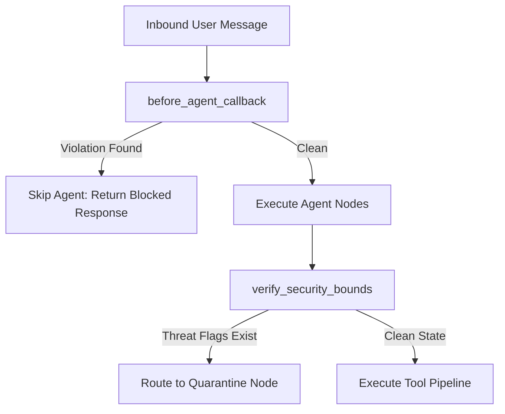

# Deterministic Compliance Skills

This directory contains our code-first compliance verification hooks. Unlike non-deterministic AI agents, these skills execute deterministic evaluation code to enforce compliance boundaries before and during agent activities.

## Directory Components

- **[verification.py](file:///c:/Users/manoj/Documents/agy2-projects/my-skills-project/agent-shadow-ops-auditor/src/skills/verification.py)**: Implements the `before_agent_callback` hook, which intercepts inbound user prompts to verify they do not contain prohibited audit-bypass phrases.
- **[compliance_gate.py](file:///c:/Users/manoj/Documents/agy2-projects/my-skills-project/agent-shadow-ops-auditor/src/skills/compliance_gate.py)**: Implements the `verify_security_bounds` logic, acting as the final pipeline validator that transitions the execution state to quarantined/approved based on parsed risk scores and threat signatures.
- **[verification_rules.md](file:///c:/Users/manoj/Documents/agy2-projects/my-skills-project/agent-shadow-ops-auditor/src/skills/verification_rules.md)**: Specifications mapping compliance hooks to regulatory requirements (e.g. PCI-DSS, SOC 2).

## Callback Lifecycle Integration

In **ADK 2.0**, custom callback functions are executed at specific lifecycle hooks:



To configure these hooks on workflow agents, register them under the `before_agent_callbacks` block in the topology configuration:

```yaml
before_agent_callbacks:
  - name: src.skills.verification.before_agent_callback
```
